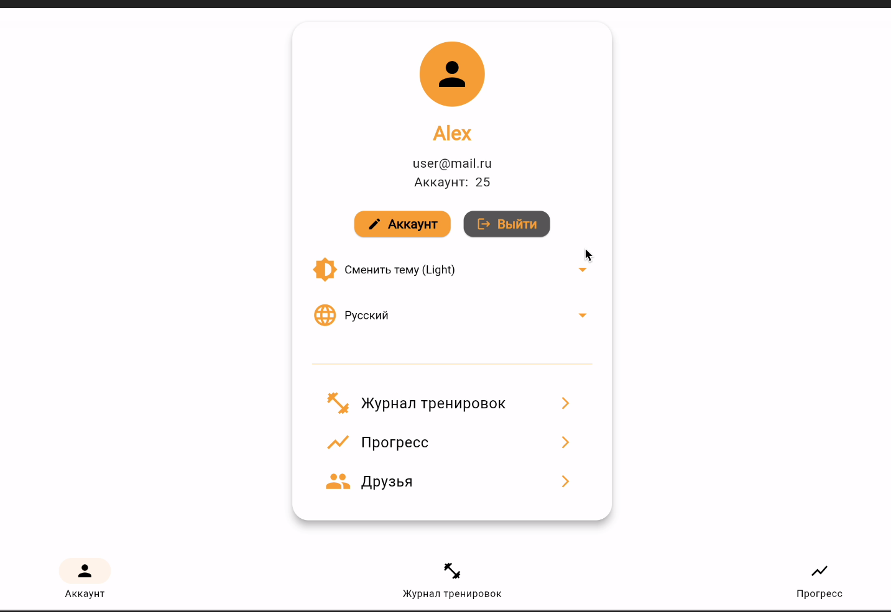

# FitGym 🏋️‍♂️

FitGym is a simple web-based fitness tracking application built with Go, Dart Flutter and PostgreSQL. It allows users to log and manage their workout routines including exercises, sets, reps, and weight.

## Features

* 📝 Create and manage workouts
* 🏋️ Add exercises with sets, reps, and weights
* 📊 Track workout history
* ✅ Simple and clean UI with Bootstrap
* 🔐 Secure login system using Flask-Login

## Tech Stack

* **Backend:** Go
* **Frontend:** Dart, Flutter
* **Database:** PostgresSQL

## Installation

Before running copy .env.example to frontend/fitgym and backend directoryes and rename it to .env.

### using Docker compose 

```
docker compose up --build -d
```

### Manually
- **For running backend part**

```
cd backend
go mod tidy
go run cmd/main.go
```
- **For running frontend part**

```
cd frontend/fitgym
flutter pub get
flutter run
```

## Contributing

Contributions are welcome! Feel free to fork this repository, make changes, and open a pull request.

## Screenshots of the main features





## Team Roles

- Zavadskii Peter Team Lead / Backend
- Zaynulin Salavat Backend
- Lutfullin Sarmat Frontend
- Fominykh Aleksei DevOps

## Link to backlog

https://github.com/orgs/Fitgym-org/projects/1


## License

MIT License. See [LICENSE](LICENSE) for more information.

---
